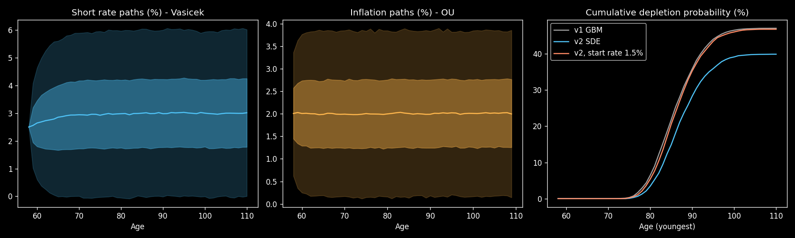
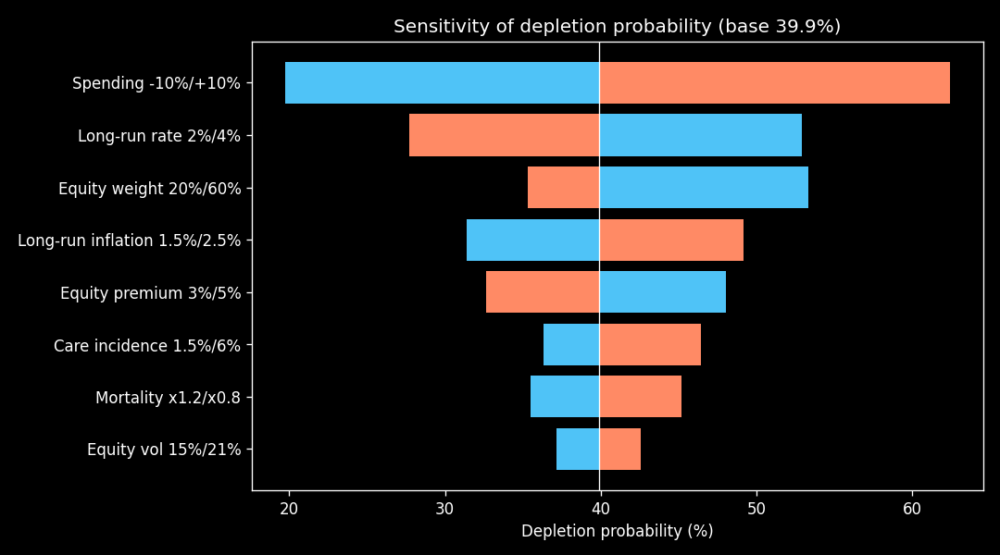
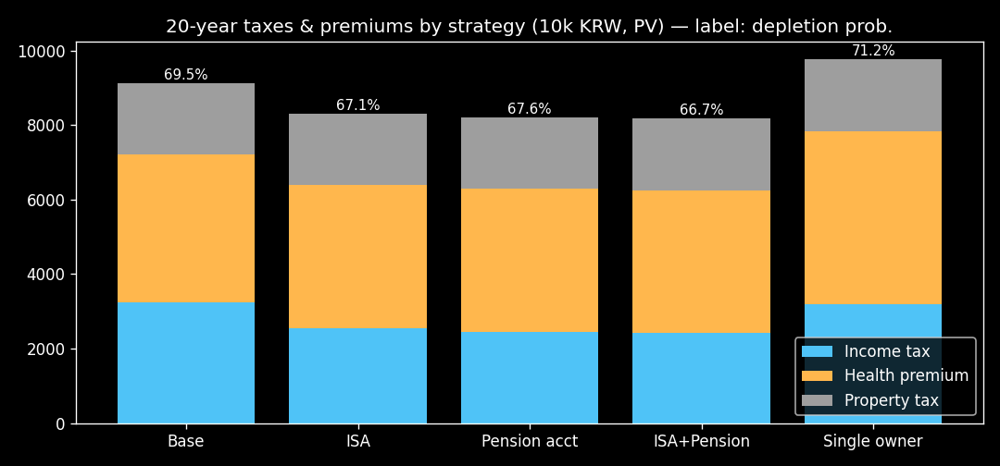

# 확률 기반 은퇴 시뮬레이터

**한국어** | [English](README.en.md)

**한국 제도를 반영한, 계리 기반 확률적 은퇴 시뮬레이터**

"은퇴 자금이 버틸까?"를 고정 수익률 계산이 아니라 **1만 개의 경제·수명 시나리오**로 답합니다.
결과는 추천이 아니라 **같은 시나리오 위에서의 선택지 비교**로 제시합니다.

[](https://colab.research.google.com/github/<GITHUB_ID>/retirement-simulator/blob/main/notebooks/retire_sim_colab.ipynb)

## 왜 만들었나

국내 은행·보험사 은퇴 계산기는 대부분 수익률과 수명을 고정한 단순 계산입니다. 해외 도구(Boldin, ProjectionLab)는 몬테카를로를 쓰지만 세금·연금 규칙이 미국 기준입니다. 이 프로젝트는 그 사이의 빈자리를 채웁니다.

## 차별점

1. **한국 제도** — 국민연금 조기·연기수령, 사적연금 1,500만원 분리과세, 금융소득종합과세, 건강보험료(지역/직장, 피부양자), 재산세·종부세, 상속·증여세
2. **계리 모델** — 생명표 기반 부부 공동생존, 간병비 점프, 사망률 크레딧
3. **확률 경제 모델** — Vasicek 금리·OU 물가(정확 이산화), 채권 가격 해석해, 금리 연동 주식 수익률
4. **선택지 비교** — 국민연금 개시 나이, ISA·연금계좌 활용, 명의 분산, 증여 전략을 공통 난수로 비교

## 구조

```
입력 → 경제 시나리오(Vasicek·OU·주식·채권) → 사망률(부부)
     → 제도·세금 모듈 → 현금흐름 엔진(1만 경로, 계좌 3개 + 주택) → 결과 지표
     → 선택지 비교 / 쇼크 테스트 / 민감도
```

```
retire_sim/        모델 패키지
  config.py        입력 스키마
  economy_v2.py    금리·물가·주식·채권 시나리오 (쇼크 입력 지원)
  mortality.py     사망률 (임시 Gompertz, 통계청 생명표 CSV 로더)
  engine.py        기본 현금흐름 엔진
  engine_tax.py    세금·계좌·부동산·사업소득 엔진
  tax.py           한국 세법·건보료 규칙 (기준일 2026-09)
  metrics.py       고갈확률·신뢰구간·팬 차트
notebooks/         Colab 노트북 (입력 셀만 고쳐서 실행)
scripts/           검증·민감도·예시 스크립트
docs/              수식·설계 문서 (MODEL.md / MODEL.en.md), 결과 그래프
```

## 사용법

**Colab:** 위 배지를 누르고 `런타임 > 모두 실행`. 2단계 입력 셀의 숫자만 바꾸면 됩니다.

**로컬:**
```bash
pip install -r requirements.txt
python scripts/validate.py      # 이론값 검증
python scripts/sensitivity.py   # 민감도 분석
```

## 결과 예시 (60·58세 부부, 금융자산 5억, 월 생활비 300만원 · 가정값 임시)

| 국민연금 개시 | 고갈확률 (±1.0%p) |
|---|---|
| 60세 | 46.6% |
| 65세 | 39.9% |
| 70세 | 40.4% |

| 쇼크 | 고갈확률 |
|---|---|
| 기준 | 39.9% |
| 은퇴 첫해 주가 −40% | 65.3% |
| 10년 뒤 주가 −40% | 55.0% |

- 같은 폭락도 **은퇴 직후**에 오면 훨씬 치명적 (수익률 순서 위험)
- 가장 민감한 변수는 시장이 아니라 **생활비** (±10% → 19.7%~62.4%)
- 세금·건보료·보유세를 반영하면(공시 6억 1주택 예시) 고갈확률 39.9% → 69.5%, ISA+연금계좌 활용 시 66.7%, 금융자산 명의를 한 사람에게 모으면 71.2%





## 검증

- OU·Vasicek 정확 이산화: 장기 평균·표준편차가 이론값과 일치 (금리 2.99%/1.84% vs 3.00%/1.83%)
- Vasicek 채권가격: 해석해 0.87706 vs 몬테카를로 0.87723
- 모든 확률 결과에 95% 신뢰구간 표시, 선택지 비교는 공통 난수 사용

## 진행 상황

| 단계 | 상태 |
|---|---|
| 현금흐름 엔진, 부부 사망률, 간병비, 금리·물가 SDE, 검증 | 완료 |
| 쇼크 테스트, 민감도, 신뢰구간 | 완료 |
| 세금·건보료·보유세·상속증여세·사업소득 (근사) | 완료 |
| 통계청 생명표·ECOS 실데이터 파라미터 | 예정 |
| 보험 모듈(종신연금·간병보험), 주택 매도·주택연금 | 예정 |
| 40대 적립기, 계좌·가계부 연동, 주기적 재측정 | 예정 |

## 한계와 주의

- 수익률·물가·사망률·간병 가정은 **임시값**입니다. 절대값보다 **선택지 간 차이**를 보세요.
- 세법은 단순화했고 기준일은 2026-09입니다. **세무·투자 자문이 아니며**, 실제 결정 전 전문가 확인이 필요합니다.
- 자세한 수식과 한계는 [docs/MODEL.md](docs/MODEL.md).

## 연락처

질문, 피드백, 협업·이용 문의는 이메일로 연락 주세요.

- 이메일: <EMAIL>

## 저작권

© 2026 강민영. All rights reserved.
이 저장소의 코드, 문서, 그래프는 저작권법의 보호를 받습니다. 자유롭게 열람하실 수 있으나, 저작권자의 사전 서면 동의 없이 복제, 수정, 배포, 상업적으로 이용하는 것을 금합니다. 자세한 내용은 [COPYRIGHT](COPYRIGHT)를 참고하세요.
