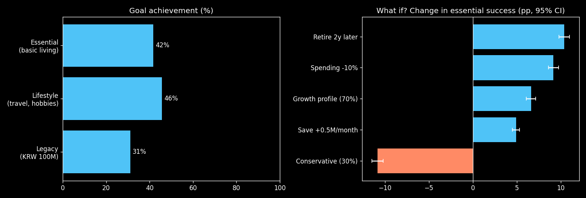
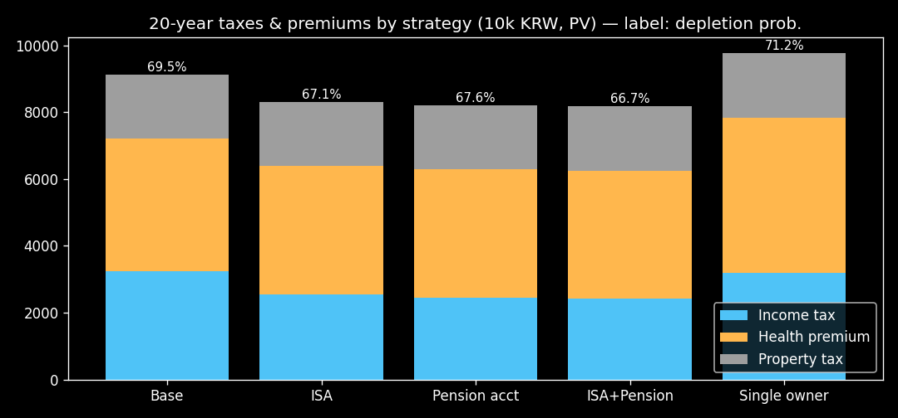

# 노후나침반 — 확률 기반 은퇴 시뮬레이터

**한국어** | [English](README.en.md)

**"얼마를 모았나"가 아니라 "원하는 은퇴생활을 지킬 수 있나"를 묻는, 한국 제도를 반영한 계리 기반 확률 은퇴 시뮬레이터**

기본생활·여행·남길 자산이라는 세 가지 목표를 1만 개의 경제·수명 시나리오 위에서 계산하고, **무엇을 바꾸면 목표에 가까워지는지**를 비교해 보여줍니다. 결과는 추천이 아니라 같은 시나리오 위에서의 비교입니다.

- **웹 앱 (설치 없이 사용):** https://<앱주소>.streamlit.app
- [](https://colab.research.google.com/github/minyoungkang1227/retirement-simulator/blob/main/notebooks/retire_sim_colab.ipynb) (분석용 노트북)

## 왜 만들었나

국내 은퇴 계산기는 대부분 수익률과 수명을 고정한 단순 계산이고, 세금·건강보험료가 빠져 있어 결과가 낙관적입니다. 해외 도구(Boldin, ProjectionLab)는 확률 시뮬레이션을 쓰지만 미국 제도 기준입니다. 이 프로젝트는 **한국 제도 + 확률 모델 + 계리 모델**을 하나로 묶어 그 빈자리를 채웁니다.

## 이렇게 동작합니다

```
① 단계별 입력: 은퇴 시점 → 자산 → 기본생활비 → 여행 예산 → 연금 → 남길 자산 → 투자 성향 → 최종 확인
② 1만 개 시나리오: 금리·물가·주가(연결된 확률과정) × 부부 각자의 수명·간병(다중상태 모델)
③ 현금흐름: 은퇴 전 저축 → 은퇴 후 기본생활비 우선, 여유가 있을 때만 여행 예산 지출
④ 세금·건보료·보유세·상속세 반영
⑤ 결과: Income Gap, 목표별 달성 확률, 필요 금융자산, "무엇을 바꾸면" 비교, "상품 추가해 보기"(주식·예금·연금·보험)
```

## 차별점

1. **목표 기반 구조** — 기본생활(지켜야 할 목표), 여행·취미(조정 가능한 목표), 남길 자산을 나누고, 나쁜 시나리오에서는 선택 지출부터 줄이는 가드레일 규칙을 적용 (보호선 = 생존확률 가중 기대 부족분 현가)
2. **한국 제도** — 국민연금 조기·연기수령, 사적연금 1,500만원 분리과세, 금융소득종합과세, 건강보험료(지역/직장, 피부양자), 재산세·종부세, 상속·증여세
3. **계리 모델** — 통계청 2024 완전생명표 기반 부부 공동생존, 간병 다중상태 마르코프(건강 → 경증 → 중증 → 사망, 장기요양 통계로 보정), 생명표 사망률 보존 보정
4. **확률 경제 모델** — ECOS 실데이터로 추정한 실질금리·물가 OU 과정과 피셔 연결, 2요인 채권 가격 해석해, 1년 금리 적분의 정확한 결합분포, 폭락 점프, 파라미터 불확실성, 운용보수
5. **통계적으로 정직한 비교** — 공통 난수 위에서 경로별 차이로 신뢰구간을 계산해 "차이 있음 / 없음"을 판정

## 결과 예시 (52세·50세 부부, 60세 은퇴, 금융자산 5억, 월 저축 150만원 · 가정값 임시)

- 기본생활비 월 300만원 + 여행 연 1,200만원 − 연금 월 160만원 → **투자자산이 매달 메워야 할 돈 240만원**
- 목표 달성: 기본생활 유지 **39%**, 여행·취미 충족 **53%**, 1억 남기기 **28%**

| 무엇을 바꾸면 | 기본생활 유지 확률 변화 (95% 신뢰구간) |
|---|---|
| 은퇴 2년 늦추기 | **+12.8%p** (±0.7) |
| 생활비 10% 줄이기 | +10.2%p (±0.6) |
| 투자 성향 성장형 | +7.3%p (±0.5) |
| 월 저축 50만원 늘리기 | +4.9%p (±0.4) |
| 투자 성향 보수형 | −11.9%p (±0.6) |

| 위기 상황 | 기본생활 유지 확률 변화 |
|---|---|
| 은퇴 첫해 주가 −40% | −15.4%p |
| 은퇴 10년 뒤 주가 −40% | −10.3%p |
| 3년 연속 물가 6% | −5.7%p |
| 예상보다 오래 삶 (사망률 −20%) | −3.5%p |
| 간병 발생 2배 | −1.0%p |

- 이 가구에서는 **은퇴 시점이 가장 강력한 수단**이고, 같은 폭락도 **은퇴 직후**에 올수록 치명적입니다(수익률 순서 위험).
- 지출을 "기본 + 선택"으로 나누면, 같은 총지출이라도 고정 지출일 때보다 고갈확률이 낮아집니다(61.9% → 55.4%).





## 검증

- OU·Vasicek 정확 이산화: 장기 평균·표준편차가 이론값과 일치 (금리 2.99%/1.84% vs 3.00%/1.83%)
- 채권 가격: Vasicek 해석해 0.87706 vs 몬테카를로 0.87723, 2요인 해석해 0.87553 vs 0.87518
- 1년 금리 적분 5×5 결합공분산: 해석해 vs 세밀 시뮬레이션 상관 최대 오차 0.005
- 사망률: 통계청 2024 완전생명표, 모델 기대여명이 공표치와 일치 (0·60·65·80세, 남녀 모두)
- 간병 다중상태 모델에서도 60세 남성 기대여명 보존 (생명표 23.7년 → 23.9년)
- OU 최우추정: 가상 데이터에서 장기 평균·변동성 복원 (회귀 속도는 소표본 과대추정 확인 → 실데이터 추정에서 편의 보정)
- 금리·물가: ECOS 2000-01~2026-08 월별 데이터로 추정 (물가 장기평균 2.47%±1.02%p, 실질금리 0.73%±0.74%p)
- 선택지 비교는 경로별 차이로 신뢰구간 계산 (독립 가정 ±1.38%p → ±0.44%p)

## 구조

```
streamlit_app.py   웹 앱 (단계별 입력 → 목표별 결과 → 무엇을 바꾸면)
retire_sim/        모델 패키지
  config.py        입력 스키마 (목표 3단, 적립기, 간병 모델)
  economy_v2.py    금리·물가·주식·채권 시나리오 (피셔 연결, 적분 금리, 점프, 쇼크)
  mortality.py     사망률, 간병 다중상태 마르코프
  engine_tax.py    세금·계좌·부동산·사업소득·목표 가드레일 엔진
  tax.py           한국 세법·건보료 규칙 (기준일 2026-09)
  calibrate.py     OU 최우추정, ECOS 데이터 연결
  market_data.py   종목코드 → 베타·상관·금리 민감도 추정
  metrics.py       고갈확률, 신뢰구간, 짝지은 비교
notebooks/         Colab 분석 노트북
scripts/           검증·민감도 스크립트 (validate.py, validate_v10.py, validate_v11.py)
docs/              수식·설계 문서 (MODEL.md / MODEL.en.md), 결과 그래프
CHANGELOG.md       버전별 변경 내역 (무엇을 / 어떻게 / 전과 무엇이 달라졌나)
```

## 사용법

- **웹 앱:** 위 링크에서 한 단계씩 입력 → "이 조건으로 계산하기"
- **Colab:** 배지를 누르고 `런타임 > 모두 실행`, 2단계 입력 셀만 수정
- **로컬:**
  ```bash
  pip install -r requirements.txt
  streamlit run streamlit_app.py      # 웹 앱
  python scripts/validate_v11.py      # 검증
  ```

## 진행 상황

| 단계 | 상태 |
|---|---|
| 현금흐름 엔진, 부부 사망률, 금리·물가 SDE, 검증 | 완료 |
| 쇼크 테스트, 민감도, 신뢰구간 | 완료 |
| 세금·건보료·보유세·상속증여세·사업소득 (근사) | 완료 |
| 모델 강화 v10 (피셔 연결, 운용보수, 파라미터 불확실성, 폭락 점프, 반대 난수) | 완료 |
| 수리적 보완 v11 (짝지은 신뢰구간, 적분 금리, 간병 다중상태, 기간 프리미엄, OU 최우추정) | 완료 |
| 웹 앱 (Streamlit) | 완료 |
| 목표 기반 재구축 v12 (3단 목표, Income Gap, 적립기, 모델 포트폴리오, 단계별 입력) | 완료 |
| 통계청 2024 완전생명표 반영 (v13) | 완료 |
| 간병 모델 실데이터 v17: 장기요양 인정률·등급 구성으로 보정한 경증·중증 2단계, 2026 본인부담·간병비 시세 | 완료 |
| 기본생활비 보호선 계리화 v16: 생존확률 가중 현가, 연금 개시·부부 생존 상태 반영 | 완료 |
| 상품 추가해 보기 v15: 종목코드 주식(베타·상관·금리 민감도), 예금, 종신연금, 간병보험, 연금저축 | 완료 |
| ECOS 금리·물가 실데이터 추정 (v14) | 완료 |
| 사망률 개선(코호트), 주식 수익률 실데이터 | 예정 |
| 주택 매도·주택연금 | 예정 |
| 계좌·가계부 연동, 주기적 재측정 | 예정 |

자세한 변경 내역은 [CHANGELOG.md](CHANGELOG.md), 수식은 [docs/MODEL.md](docs/MODEL.md)를 참고하세요.

## 한계와 주의

- 사망률은 통계청 2024 완전생명표(미래 수명 연장 미반영), 금리·물가는 ECOS 2000~2026년 데이터 추정치입니다. 간병은 건강보험공단 장기요양 통계로 보정했고, 주식 수익률만 아직 **임시값**입니다. 절대값보다 **선택지 간 차이**를 보세요.
- 세법은 단순화했고 기준일은 2026-09입니다. **투자 추천이나 세무 자문이 아니며**, 실제 결정 전 전문가 확인이 필요합니다.
- 웹 앱의 입력값은 계산에만 쓰이고 저장되지 않습니다.

## 연락처

- 이메일: doongss1@naver.com

## 저작권

© 2026 강민영. All rights reserved. 이용 문의는 이메일로 부탁드립니다. 자세한 내용은 [COPYRIGHT](COPYRIGHT)를 참고하세요.
