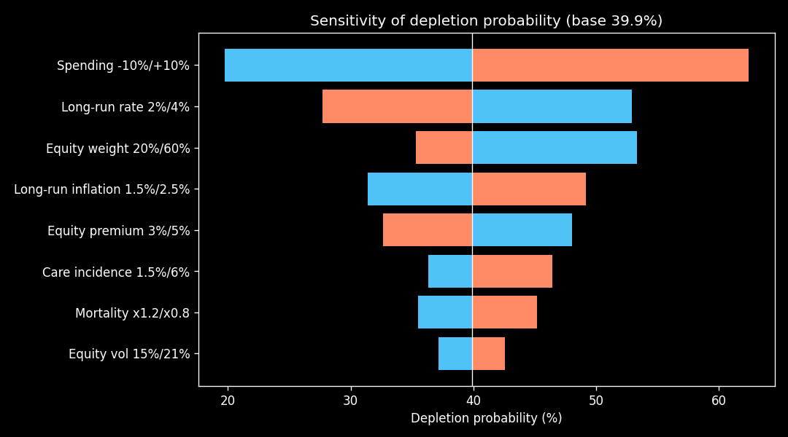

# Model Documentation — Probabilistic Retirement Simulator

[한국어](MODEL.md) | **English**

> As of 2026-09 · Currency unit: KRW 10,000 (만원) · Time step: 1 year

## 1. Purpose and scope

The model computes the probability that a retired household's assets last for as long as its members live, and answers two questions:

- **① Choice comparison**: how does the depletion probability change with the National Pension claiming age, withdrawal order, asset allocation, and similar choices?
- **③ Insurance value**: how much do existing or new insurance products reduce depletion probability and shortfall, and at what cost?

Results are presented as **comparisons under identical scenarios**, not as recommendations.

## 2. Notation

| Symbol | Meaning |
|---|---|
| $W_t$ | Liquid assets at the start of year t (nominal) |
| $r_t$ | Short rate |
| $\pi_t$ | Inflation rate, $CPI_t=\prod_{s<t}(1+\pi_s)$ |
| $q_x$ | One-year death probability at age x |
| ${}_tp_x$ | Probability that a person aged x survives t more years $=\prod_{s=0}^{t-1}(1-q_{x+s})$ |
| $N$ | Number of simulated paths (default 10,000) |

## 3. Economic scenarios

### 3.1 Short rate — Vasicek

$$dr_t=\kappa_r(\theta_r-r_t)\,dt+\sigma_r\,dW^r_t$$

Exact discretization (Δt = 1):

$$r_{t+1}=\theta_r+(r_t-\theta_r)e^{-\kappa_r}+\sigma_r\sqrt{\tfrac{1-e^{-2\kappa_r}}{2\kappa_r}}\,\varepsilon^r_{t+1}$$

### 3.2 Inflation — Ornstein–Uhlenbeck

Same form as the short rate with parameters $(\kappa_\pi,\theta_\pi,\sigma_\pi)$, using exact discretization.

### 3.3 Equities

$$\ln(1+R^S_t)=r_t+\text{ERP}-\tfrac12\sigma_S^2+\sigma_S\,\varepsilon^S_t$$

### 3.4 Bonds — rolling D-year zero-coupon fund

Closed-form Vasicek zero-coupon price:

$$P(\tau,r)=\exp\{A(\tau)-B(\tau)r\},\quad B(\tau)=\tfrac{1-e^{-\kappa_r\tau}}{\kappa_r},$$
$$A(\tau)=\Big(\theta_r-\tfrac{\sigma_r^2}{2\kappa_r^2}\Big)(B(\tau)-\tau)-\tfrac{\sigma_r^2B(\tau)^2}{4\kappa_r}$$

One-year return: $R^B_t=P(D-1,r_{t+1})/P(D,r_t)-1$ (zero risk premium assumed).

### 3.5 Correlation

$(\varepsilon^r,\varepsilon^\pi,\varepsilon^S)$ are standard normals with correlation matrix $C$, generated via the Cholesky factorization $C=LL^\top$.

| Parameter | Value (placeholder) | Parameter | Value (placeholder) |
|---|---|---|---|
| $r_0,\theta_r,\kappa_r,\sigma_r$ | 2.5%, 3%, 0.15, 1% | ERP, $\sigma_S$ | 4%, 18% |
| $\pi_0,\theta_\pi,\kappa_\pi,\sigma_\pi$ | 2%, 2%, 0.40, 1% | D | 5 years |
| $\rho_{r\pi},\rho_{rS},\rho_{\pi S}$ | 0.5, −0.2, −0.1 | | |

## 4. Mortality

- **From v13:** Statistics Korea 2024 complete life table (single-year ages) by sex. Ages 100+ extrapolated to 109 by fitting a Gompertz line to $\ln\mu_x$ at ages 90–99, with $q_{110}=1$. Life expectancies match published values.
- Before (v1–v12): placeholder Gompertz (life expectancy at 60: 23.5 male, 29.5 female)
- Limitation: period table, no future mortality improvement
- Each spouse is simulated independently. Last-survivor probability ${}_tp_{\overline{xy}}={}_tp_x+{}_tp_y-{}_tp_x\,{}_tp_y$

## 5. Institutional rules (as of 2026-09, kept in a separate configuration)

- National Pension: 6% reduction per year of early claiming (up to 5 years), 7.2% increase per year of deferral (up to 5 years), CPI-indexed
- Private pensions: 3.3–5.5% separate taxation up to KRW 15M per year; above that, full comprehensive taxation or 16.5% separate taxation (Section 12)
- Health-insurance dependent status: annual income including public pensions up to KRW 20M; private pensions excluded (Section 12)

## 6. Cash-flow recursion

For each path and year:

$$W_{t+1}=\max\big(W_t+I_t-C_t-K_t,\,0\big)\,\big(1+wR^S_t+(1-w)R^B_t\big)$$

- $I_t$: National Pension of surviving members ($\times CPI_t$) + private pensions (fixed nominal)
- $C_t$: spending $\times CPI_t\times$ (0.7 when only one spouse survives)
- $K_t$: long-term-care costs. Occur with annual probability $\lambda$ for survivors aged 75+, lognormal cost, lasting 3 years
- Depletion: the first year in which $W_t+I_t-C_t-K_t\le0$ while the household is alive

## 7. Metrics

| Metric | Definition |
|---|---|
| Depletion probability | $P(\text{depletion time}<\text{last death})$ |
| Depletion-age distribution | Quantiles of depletion time among depleted paths |
| Expected shortfall | Mean present value of the shortfall on depleted paths *(planned)* |
| Fan chart | 5/25/50/75/95th percentiles of real wealth $W_t/CPI_t$ among surviving households |

Choice comparisons use **common random numbers**, so differences reflect the choice rather than sampling noise.

## 8. Insurance module (theory fixed, implementation planned)

- Life-annuity present value: $\ddot a_x=\sum_t v^t\,{}_tp_x$; annuity payment = single premium / ($\ddot a_x\times$(1 + loading))
- Mortality credit: effective return to survivors $(1+i)/(1-q_x)-1$
- Long-term-care net premium (equivalence principle): $P\,\ddot a_{x:\overline{n}|}=B\sum_t v^{t+1}{}_tp_x\,i_{x+t}$
- Endowment: $A_{x:\overline{n}|}=A^1_{x:\overline{n}|}+{}_nE_x$
- Pricing uses insurer experience tables while the simulation uses population tables, which exposes the insurer's margin
- Benefits are tied to the same death and care events generated by the engine
- Value metrics: Δ depletion probability, Δ expected shortfall, expected present value of loadings, reduction per KRW 1M of cost

## 9. Validation

| Item | Theory | Simulation |
|---|---|---|
| Long-run rate mean / std. dev. | 3.00% / 1.83% | 2.99% / 1.84% |
| Long-run inflation mean / std. dev. | 2.00% / 1.12% | 1.98% / 1.13% |
| 5-year zero-coupon price | 0.87706 (closed form) | 0.87723 (MC, weekly steps) |

Planned: comparison with Statistics Korea life expectancy, Milevsky-style analytical approximations of lifetime ruin probability, KOSPI historical backtests.

## 10. Sensitivity analysis (example household, baseline depletion probability 39.9%)

| Assumption (low / high) | Depletion probability | Range |
|---|---|---|
| Spending −10% / +10% | 19.7% / 62.4% | 42.7pp |
| Long-run rate 2% / 4% | 52.9% / 27.7% | 25.2pp |
| Equity weight 20% / 60% | 53.3% / 35.3% | 18.0pp |
| Long-run inflation 1.5% / 2.5% | 31.4% / 49.2% | 17.8pp |
| Equity risk premium 3% / 5% | 48.0% / 32.6% | 15.4pp |
| Care incidence 1.5% / 6% | 36.3% / 46.4% | 10.1pp |
| Mortality ×1.2 / ×0.8 | 35.5% / 45.2% | 9.7pp |
| Equity volatility 15% / 21% | 37.2% / 42.6% | 5.4pp |

Interpretation: the result is driven most by **spending, which the household controls**, rather than by market assumptions. The long-run rate matters a lot because expected equity returns are defined as rate plus risk premium, so the rate feeds into both equities and bonds.

## 11. Limitations

- Parameter uncertainty: expected future returns carry large estimation error → shown as ranges and scenarios
- Interpreting probabilities: depletion probability is a statistic over 10,000 scenarios and does not predict an individual outcome
- Vasicek allows negative rates (about 4.7% of path-years) → comparison with CIR planned
- Zero bond risk premium; independent spousal mortality
- Events outside the model (divorce, supporting children, property crashes) and future rule changes are not captured
- **Differences between choices** are more reliable than absolute levels, because shared assumption errors largely cancel

## 12. Tax, health-insurance and property module (engine_tax, approximate)

The engine tracks three accounts (taxable, ISA, pension) and housing (illiquid) per path. Order within each year:
pension income → gifts → account transfers → spending → pension-account withdrawal → taxes, premiums, holding taxes → taxable/ISA withdrawals → returns → inheritance.

| Item | Treatment (as of 2026-09, simplified) |
|---|---|
| Comprehensive income tax | Public pension (taxable share, pension-income deduction) + business income + rental income, progressive rates, 10% local tax |
| Financial-income taxation | Comparative taxation when interest and dividends exceed KRW 20M per year |
| Private pensions | 3.3–5.5% up to KRW 15M per year, 16.5% above |
| Foreign-equity capital gains | Cost basis tracked, 22% above a KRW 2.5M annual deduction (paid the following year) |
| Health-insurance premiums | Regional: 50% of public pensions + financial income (fully counted above KRW 10M) + rental/business income + property component (user input) / Workplace (business owner): business income + other income above KRW 20M / dependent income and property tests |
| Property and comprehensive real-estate taxes | Fair-market-value ratios, progressive rates, comprehensive tax assessed per person (KRW 900M deduction each), senior and long-holding credits for single-home owners (80% cap) |
| Inheritance and gift taxes | At the second death; lump-sum and financial-asset deductions; gifts within 10 years added back; KRW 50M gift deduction per 10 years |
| Tax strategies | ISA (KRW 20M per year, 100M total), pension accounts (KRW 18M per year transferred, withdrawals up to 15M per year after 5 years), ownership splitting, 10-year gifting cycles |

Not included: dividend gross-up credit, high-dividend separate-taxation special rule, home sale and capital-gains tax, reverse mortgages, pension-account tax credits, first-death inheritance tax, earnings-related National Pension reduction.
All tax figures live in `retire_sim/tax.py` and need annual updates. **This is not tax or investment advice.**

## 13. v10 model enhancements (economy_v2 options, `EconomyV2.enhanced()`)

| Item | Description | Effect (example household, baseline 39.9%) |
|---|---|---|
| Fisher link | Real rate $q$ and inflation $\pi$ follow separate OU processes; nominal rate $r=q+\pi$. Bonds priced with the two-factor Gaussian closed form $P=\exp(-E[\int r]+\tfrac12 Var[\int r])$ | 39.3%. The high-inflation scenario (long-run 3.5%) moves from 69.2% to 50.4%, removing the inconsistency of rates not following inflation |
| Management fees | 0.5% per year deducted from equity and bond returns | 49.2% (+9.9pp) — the largest change; earlier results were optimistic |
| Parameter uncertainty | Per-path ERP ~ N(4%, 1%), long-run inflation ~ N(2%, 0.5%) | Mean 49.6%; paths in the lowest ERP third 57.4% vs highest third 41.1% |
| Crash jumps (Merton) | 0.1 jumps per year, log jump N(−15%, 10%), compensator $-\lambda k$ keeps the mean return | Mean return preserved (7.17% → 7.16%); worst 1% annual return −30.8% → −33.7% |
| Antithetic variates | Half of the paths use $-Z$; standard errors computed from pair means | 95% CI ±0.98pp → ±0.82pp |

Validation (`scripts/validate_v10.py`): the two-factor formula reduces to Vasicek in the one-factor case (0.877060); two-factor 5-year bond price closed form 0.87553 vs Monte Carlo 0.87518; long-run nominal rate 3.00% (theory 3.00%).
With the v10 settings the overall depletion probability is 49.1% (74.6% with the tax engine). The default `EconomyV2()` reproduces the original v2 results.

## 14. v11 mathematical refinements

- **① Integrated rate.** Equity returns use the one-year integral $\int r\,ds$ instead of the start-of-year rate, matching how bonds are priced. The end-of-year factor values, their integrals and the equity shock are drawn jointly from a 5×5 Gaussian whose covariance follows from the Itô isometry (formulas in the Korean section 14). Max correlation error vs a fine-step simulation: 0.005.
- **② Paired differences.** Choice comparisons use $d_i=\mathbb 1[A_i]-\mathbb 1[B_i]$; with common random numbers the CI shrinks from ±1.38pp to ±0.44pp.
- **③ Multi-state care model.** Markov chain {Healthy, Care, Dead} with care mortality multiplier $m=2.5$ and recovery 0.1; healthy mortality is scaled so the life-table mortality is preserved (life expectancy at 60: 23.5 → 23.6 years).
- **④ Market price of risk.** Paths under P, bond prices under Q with $\theta^Q=\theta+0.5\%$, producing a term premium (bond mean return 2.46% → 2.77%).
- **⑤ OU maximum likelihood.** Exact MLE via the AR(1) closed form with delta-method standard errors, plus ECOS fetch and Fisher-mode calibration helpers. Synthetic tests recover θ and σ; κ shows the known small-sample upward bias.

Before/after numbers are in [CHANGELOG.md](../CHANGELOG.md).

## 15. v12 goal-based structure

- Spending split into Essential $E_t$ (protected), Lifestyle $L_t$ (flexible) and a Legacy target $G$.
- Guardrail: after retirement, the floor $F_t=\max(E_t-I_t,0)\cdot\ddot a_{\overline{n}|2\%}$ with $n=\max(5,95-x_t)$; lifestyle paid $=\min(L_t,\max(W_t-F_t,0))$.
- Metrics: essential success probability, average lifestyle funding ratio, probability that after-tax estate ≥ $G$.
- Accumulation phase: before retirement no spending, annual savings added.
- Required assets: bisection on initial assets for a 90% essential success probability, using common random numbers.

## 16. v14 rate and inflation estimation

ECOS monthly data 2000-01 to 2026-08: inflation = CPI year-on-year; ex-post real rate = 3-year treasury yield − inflation. Exact OU MLE with AR(1) small-sample bias correction $\hat b\to\hat b+(1+3\hat b)/n$.

| Factor | Long-run mean θ (±95%) | Mean reversion κ (before→after correction) | Volatility σ | Start |
|---|---|---|---|---|
| Inflation | 2.47% (±1.02pp) | 0.51 → 0.35 | 1.33% | 3.09% |
| Real rate | 0.73% (±0.74pp) | 0.72 → 0.56 | 1.37% | 0.70% |

Standard errors of the long-run means are used as per-path parameter uncertainty. Nominal long-run mean 3.20%.

## 17. v15 add-on products

Individual stocks (single-index model with a rate-change term; β, idiosyncratic volatility and rate sensitivity estimated from 10 years of monthly prices), deposits, single-premium life annuities (priced with 0.8× life-table mortality, 3% discount, 5% loading; single or joint-last), long-term-care insurance (premium by the equivalence principle on the engine's own care paths, 30% loading) and pension-account contributions (13.2% tax credit). New metric: average real shortfall when depleted. Add-on noise uses a separate random stream so paired comparisons remain valid.

## 18. v16 actuarial floor

The essential floor becomes the survival-weighted present value of future essential shortfalls, computed separately for three household states (both alive, only you, only spouse), using life-table survival × 0.8 mortality, a 2% real discount rate, and projected guaranteed income (National Pension from its start age, fixed-nominal private pensions deflated by expected inflation, rent). Lifestyle spending is paid only above this floor. Previously (v12–v15) the current-year shortfall was treated as lasting to age 95 with certainty.

## 19. v17 two-level long-term-care model

States healthy / mild (grades 3–5, cognitive support) / severe (grades 1–2) / dead. Incidence by age is calibrated so that simulated prevalence matches national figures (1.235M recognised in 2025 × age mix ÷ population: 1.5% at 65–69 up to 55.4% at 90+), with the severe share matched to 12.7%. Mortality multipliers 1.8 (mild) and 4.0 (severe), healthy mortality rescaled to preserve the life table. Annual costs (today's KRW): mild median 7.2M, severe median 18M (lognormal), based on 2026 out-of-pocket rules and caregiver market prices.
